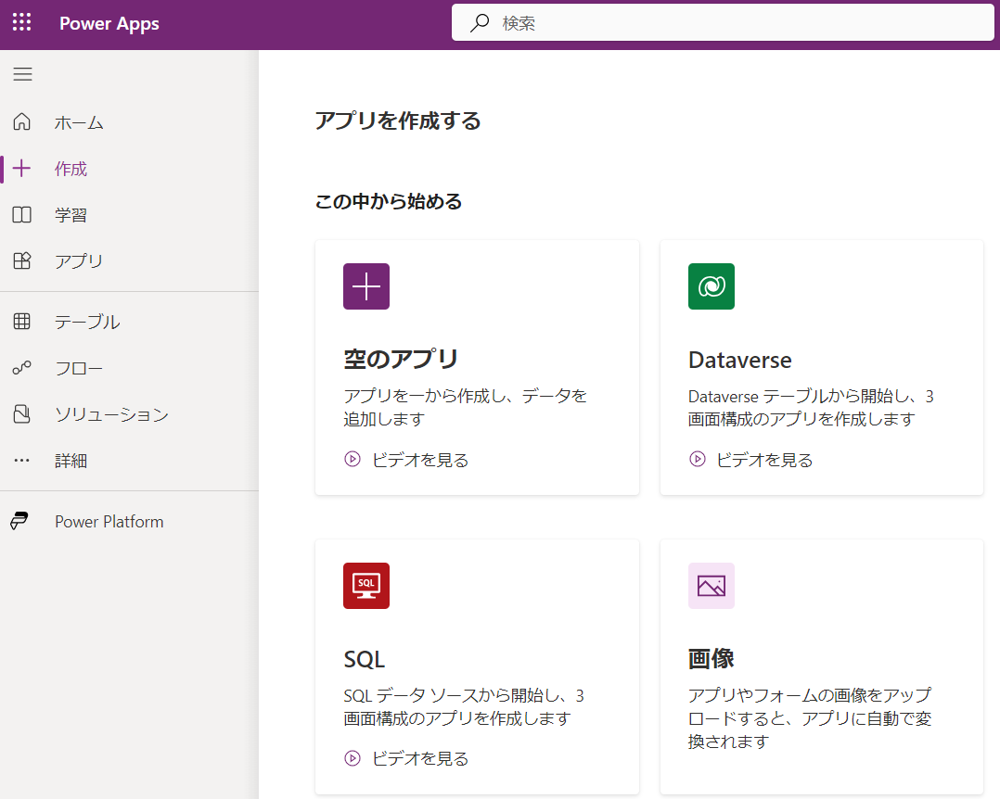
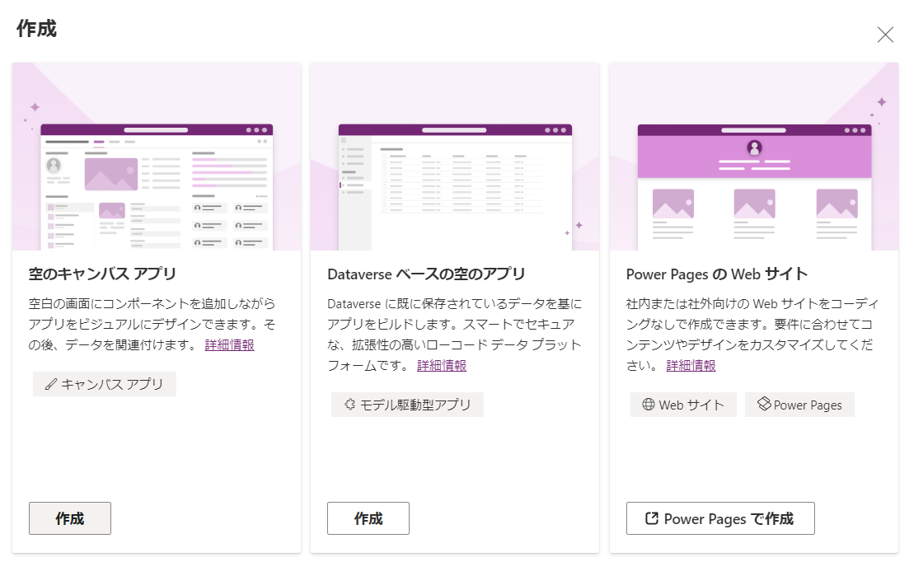
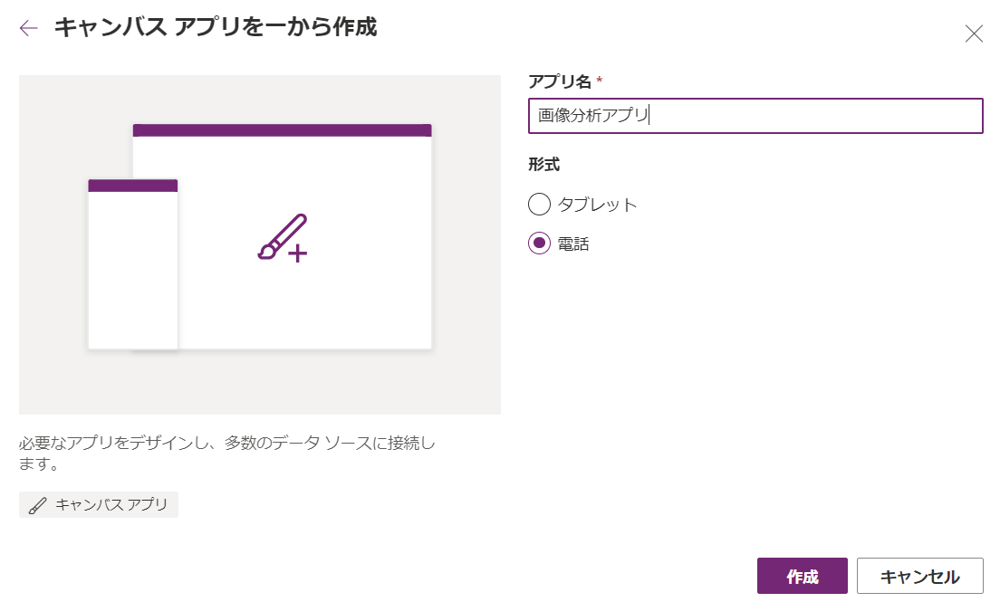
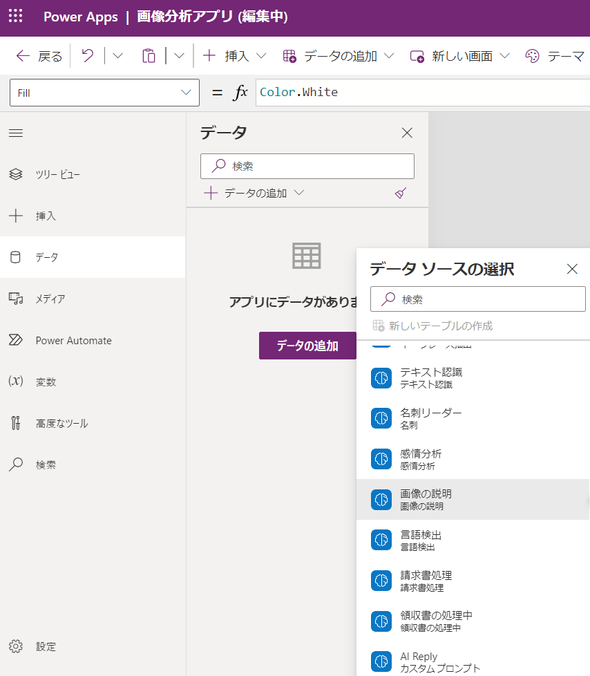
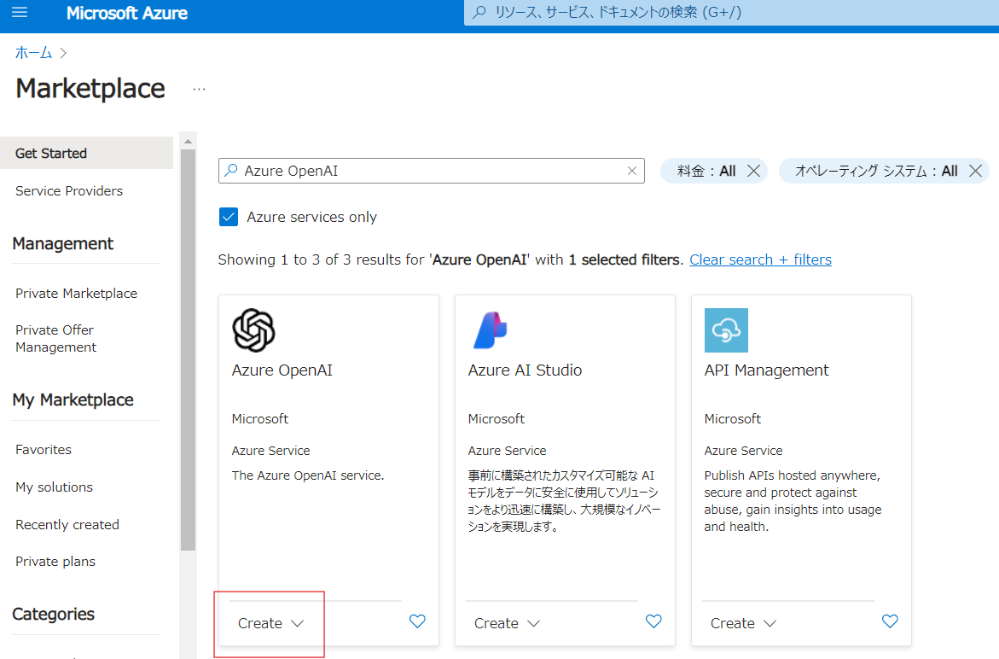
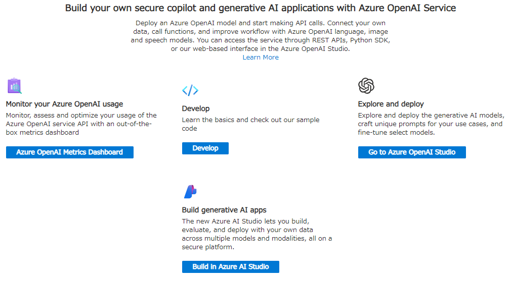

- [3分半で分かる Power Apps](https://www.youtube.com/watch?v=DBOgns5lOsw)
- <https://learn.microsoft.com/ja-jp/power-apps/>
- <https://learn.microsoft.com/ja-jp/power-apps/powerapps-overview>
- <https://learn.microsoft.com/ja-jp/power-apps/maker/>
- <https://learn.microsoft.com/ja-jp/dynamics365/mixed-reality/guides/pc-app-website-powerapps-link#add-a-power-apps-link-to-a-step>
- <https://learn.microsoft.com/ja-jp/ai-builder/azure-openai-model-papp>
- <https://make.powerapps.com>
- <https://learn.microsoft.com/ja-jp/azure/ai-services/openai/overview>
- <https://github.com/openai/openai-python/tree/main>
- <https://learn.microsoft.com/ja-jp/azure/ai-services/openai/chatgpt-quickstart?tabs=command-line%2Cpython-new&pivots=programming-language-python>

## Azure OpenAI

