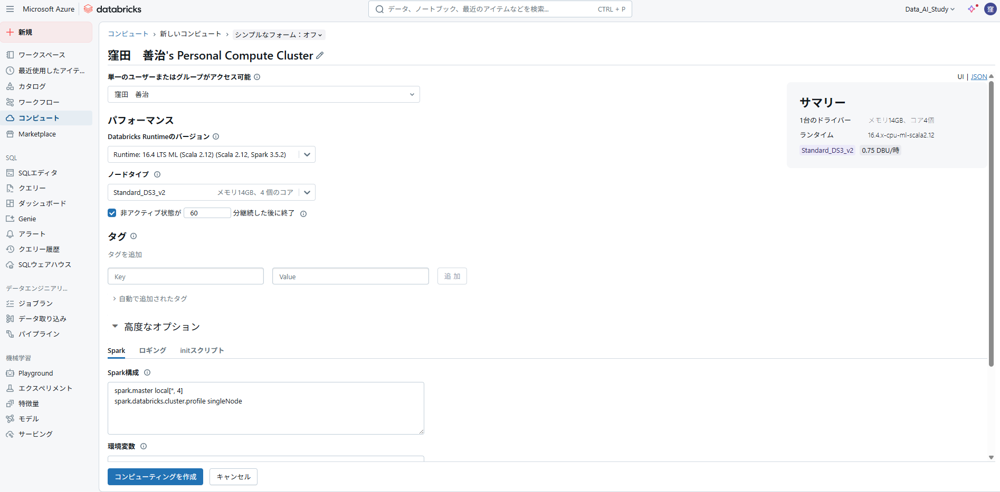
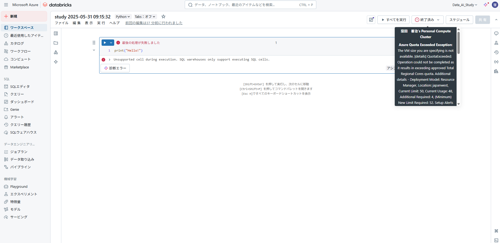

## Azure の Databricks 環境



エラーになった


```log
Azure Quota Exceeded Exception:
The VM size you are specifying is not available. [details] QuotaExceeded: Operation could not be completed as it results in exceeding approved Total Regional Cores quota. Additional details - Deployment Model: Resource Manager, Location: japanwest, Current Limit: 50, Current Usage: 48, Additional Required: 4, (Minimum) New Limit Required: 52. Setup Alerts when Quota reaches threshold. Learn more at https://aka.ms/quotamonitoringalerting . Submit a request for Quota increase at https://aka.ms/ProdportalCRP/#blade/Microsoft_Azure_Capacity/UsageAndQuota.ReactView/Parameters/%7B%22subscriptionId%22:%221c227087-4df9-4536-ac88-7c09aede7c51%22,%22command%22:%22openQuotaApprovalBlade%22,%22quotas%22:[%7B%22location%22:%22japanwest%22,%22providerId%22:%22Microsoft.Compute%22,%22resourceName%22:%22cores%22,%22quotaRequest%22:%7B%22properties%22:%7B%22limit%22:52,%22unit%22:%22Count%22,%22name%22:%7B%22value%22:%22cores%22%7D%7D%7D%7D]%7D by specifying parameters listed in the ‘Details’ section for deployment to succeed. Please read more about quota limits at https://docs.microsoft.com/en-us/azure/azure-supportability/regional-quota-requests(OnDemand)
```
